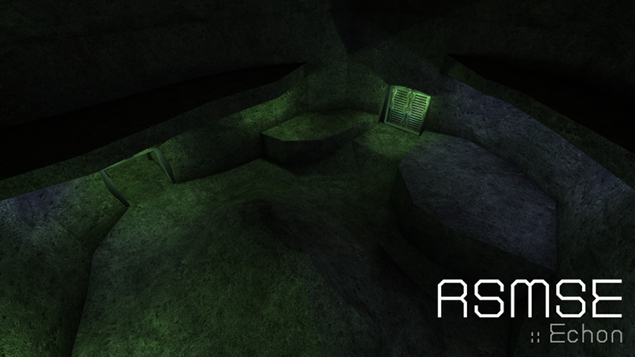

RSMSE
-----

This is a map designed by Echon for the Gloom Quake Ⅱ modification and ported by bsp1t to Unvanquished. This project enhances the map and fix some issues.

Levelshot
---------



How-to
------

* Get the source

```
git clone https://github.com/InterstellarOasis/map-rsmse_src.dpkdir.git
cd map-rsmse_src.dpkdir/
```

* Build

You need the [Urcheon](https://github.com/illwieckz/Urcheon) tool and the [illwieckz`s netradiant branch](https://gitlab.com/illwieckz/netradiant/commits/illwieckz).  
You will find the dpkdir in `build/test`.

```
export PAKPATH="/where/you/installed/unvanquished/pkg"
urcheon build
```

* Package

You will find the dpk in `build/pkg`.

```
urcheon package
```

Run the map:

```
daemon -pakpath build/pkg +devmap rsmse
```

Credits
-------

Unvanquished port:

* Thomas “illwieckz“ Debesse <dev@illwieckz.net> (http://gg.illwieckz.net)
* bsp1t

Mapping:

* Echon <n_blast@hotmail.com>

History
-------

* 2014-10-26:	RSMSE Unvanquished port by bsp1t
* Unknown:		RSMSE r2 for Gloom
